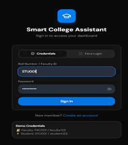
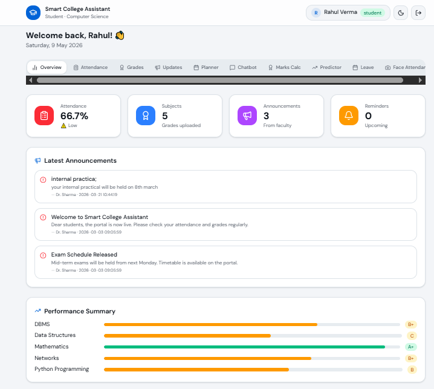
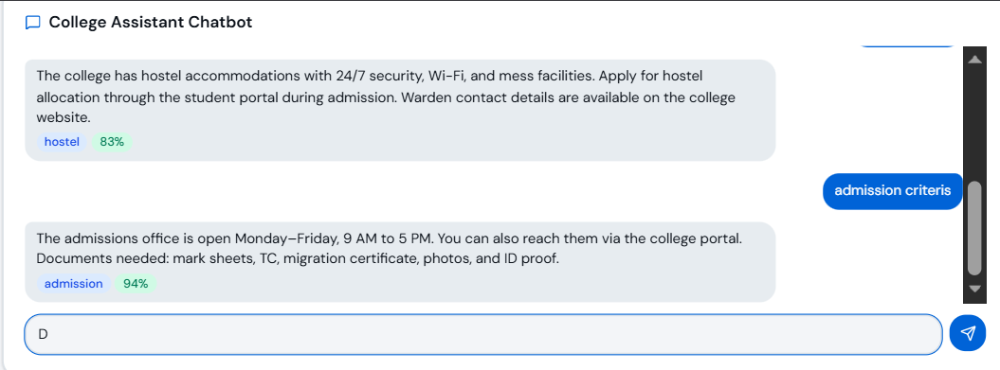

# Smart College Assistant 🎓

Modern student assistance platform built using TypeScript to improve academic accessibility, organization, and interaction for students.

---


---
## 📌 Project Overview

Smart College Assistant is a web-based platform designed to help students manage and interact with academic resources more efficiently.

The project focuses on creating a modern and user-friendly interface while solving common student-related problems through technology.

---

## ✨ Features

- Student-focused interface
- Smart assistant functionality
- Responsive modern UI
- Fast and interactive experience
- Clean frontend structure
- Real-world deployment workflow
---

## 🛠 Tech Stack

### Frontend
- TypeScript
- HTML
- CSS

### Tools & Platforms
- GitHub
- VS Code
- Deployment Platforms

---
## 📷 Project Screenshots

### Homepage


### Dashboard


### Assistant Interface


---
## 📂 Project Structure

```bash
smart-college-assistant/
│
├── images/
├── src/
├── public/
├── README.md
└── package.json
```

---

## ▶️ How To Run Locally

1. Clone the repository

```bash
https://github.com/heena-jindal/smart-college-assistant
```

2. Install dependencies

```bash
npm install
```

3. Run the development server

```bash
npm run dev
```

---

## 📈 Future Improvements

- AI chatbot integration
- Authentication system
- Database connectivity
- Student performance analytics
- Cloud deployment enhancements

---
## 🔑 Demo Credentials
- Faculty: FAC001 / faculty123
- Student: STU001 / student123

---

## 👩‍💻 Author

Heena Jindal

---

⭐ Building impactful projects and continuously learning new technologies.
